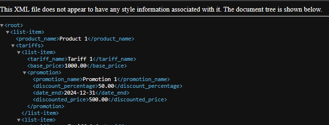

## DRF: Представление продуктов с тарифами с учетом акций

### Цель и задача
В учебных целях на базе Django+DRF реализовано представление, возвращающее на заданном эндпоинте
в xml формате информацию о всех продуктах и их действующих тарифах с учетом акций, пример вывода:

#### Используемые технологии
* Django
* Django Rest Framework

##### Структура
* ./conf - каталог с настройками Django,
* ./products - приложение c моделями, сериализаторами, представлениями.

#### Модели данных и логика вывода

* Product: Название
* Tariff: Название, базовая цена, Product (fk)
* Promotion: Название, процент скидки, дата начала, дата окончания, Tariff (many2many)

В итоговую выыдачу попадают все продукты и их тарифы, для каждого тарифа отображается только акция с максимальной скидкой на сегодняшний день.

#### Установка и запуск

1. Клонировать репозиторий
2. Создать .env файл в корне проекта, .env.sample является образцом, который может быть переименован и заполнен данными для подключения к PostgreSQL.
    
    При отсутствии значения для переменной окружения DB_HOST по умолчанию будет использоваться путь к SQLite БД в корне проекта: db.sqlite3.
3. Установить зависимости: `pip install -r requirements.txt`
4. Применить миграции: `python manage.py migrate`
5. Запустить сервер: `python manage.py runserver`

* При необходимости можно создать суперпользователя `python manage.py createsuperuser`

* Тестовые данные подготовлены в файле ./products/management/load_test_db.py
* Их можно загрузить в БД командой `python manage.py load_test_db`

Доступные эндпоинты:
* /products/xml/ - описанное выше представление;
* /admin/ - админка Django (Модели зарегистрированы в админке, могут быть созданы, отредактированы и удалены также в ней).
